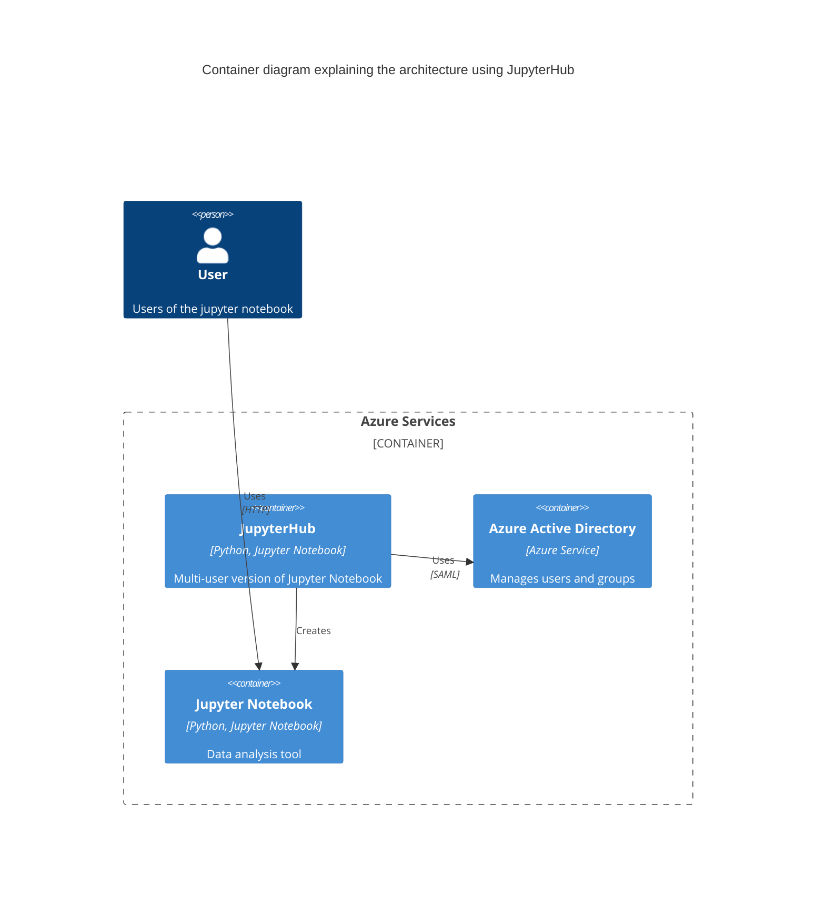

# Task
Propose a hybrid cloud service to allow 100 users to perform simple data analysis

# Solution

We propose using JupyterHub as the starting point for this solution. JupyterHub is a multi-user version of Jupyter Notebook (https://jupyter.org/hub)

We can run this JupyterHub using Kubernetes on Azure AKS (https://z2jh.jupyter.org/en/stable/jupyterhub/installation.html). Some additional work would be reqired to enable GPU support for the JupyterHub, but it is possible (https://learn.microsoft.com/en-us/azure/aks/gpu-cluster)

For authentication, it is possible to use Azure Active Directory (https://z2jh.jupyter.org/en/stable/getting-started/authenticators-users-basics.html#azure-active-directory-authenticator)

# Architecture

