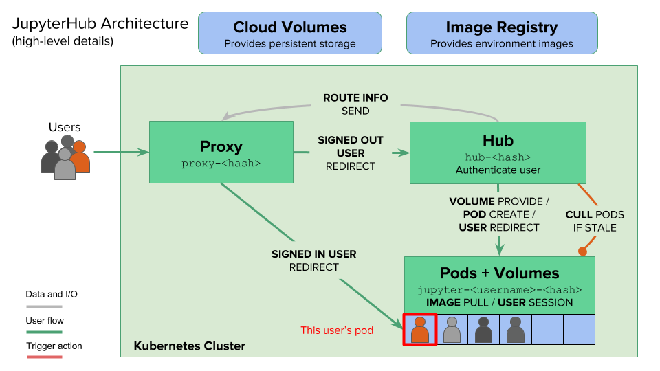
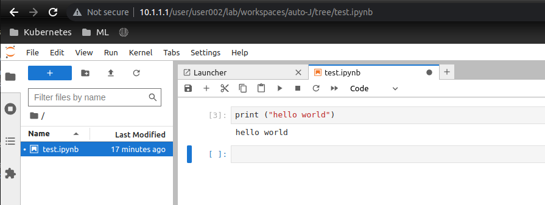

# Problem

Propose a hybrid cloud service to allow 100 users to perform simple data analysis (similar to jupyter notebook)

You may assume this is specifically for the education sector (students, teachers, etc)

# Solution

We propose using JupyterHub as the starting point for this solution. JupyterHub is a multi-user version of Jupyter Notebook (https://jupyter.org/hub)

The recommendation is to use JupyterHub with Kubernetes for large number of user (> 100), and to use the littlest JupyterHub for small number of users (< 100) (https://tljh.jupyter.org/en/latest/)

Considering we have 100 users, and that we may not have the sufficient GPU resources to support all 100 users, we will use JupyterHub with Kubernetes, and the Kubernetes cluster should be hosted on a cloud service (Azure AKS) with GPU support. We assume these users will be using the JupyterHub for data analysis, and will require GPU support.

We can run this JupyterHub using Kubernetes on Azure AKS (https://z2jh.jupyter.org/en/stable/jupyterhub/installation.html). Some additional work would be reqired to enable GPU support for the JupyterHub, but it is possible (https://learn.microsoft.com/en-us/azure/aks/gpu-cluster)

For authentication, it is possible to use Azure Active Directory (https://z2jh.jupyter.org/en/stable/getting-started/authenticators-users-basics.html#azure-active-directory-authenticator)

# Architecture

The official documentation provides how jupyterhub architecture is like

We give another view of how it will work specifically with Azure services

# Proof of Concept

We create a POC on how this would work, but instead of using Azure Directory Services, we will simulate this via our own created OpenLDAP docker image (on premise). We will also use our own kubernetes cluster (on premise via KVM) instead of Azure AKS. No GPU support will be enabled in this POC.

1. Create a kubernetes cluster. In our case we will create a cluster using our own terraform scripts [here](https://github.com/nicholas-yjtang/scripts/tree/main/terraform/kubernetes)
2. Install a LDAP service on the cluster. We create a docker that creates a OpenLDAP service that the cluster can talk to [here](https://github.com/nicholas-yjtang/scripts/tree/main/docker/openldap)
3. Install JupyterHub on the cluster. We use the helm chart provided by JupyterHub. You can run this with the install.sh included under scripts, along with the config.yaml required to integrate with OpenLDAP
4. Apply the network.yaml that allows the pods in the namespace to talk to each other

# Results

We can see that the JupyterHub is running on the cluster, and we can login using the LDAP credentials (user002)

