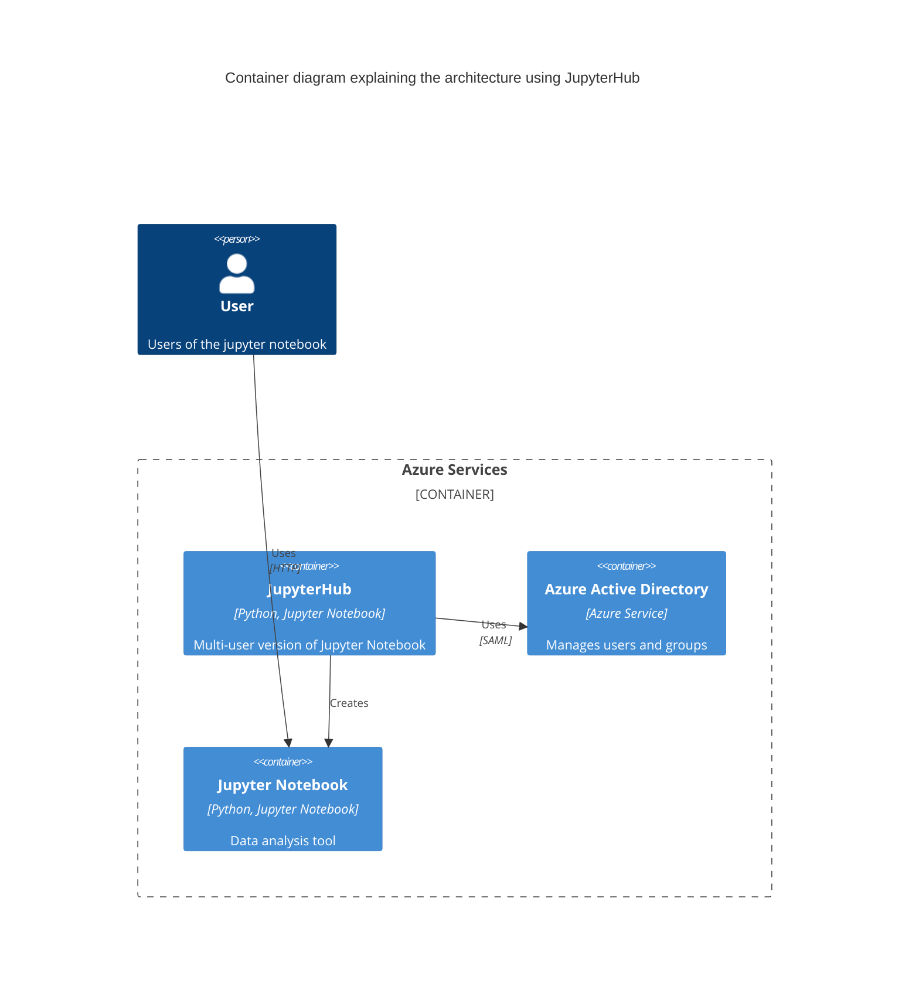

# Task
Propose a hybrid cloud service to allow 100 users to perform simple data analysis

# Solution

We propose using JupyterHub as the starting point for this solution. JupyterHub is a multi-user version of Jupyter Notebook (https://jupyter.org/hub)

We can run this JupyterHub using Kubernetes on Azure AKS (https://z2jh.jupyter.org/en/stable/jupyterhub/installation.html). Some additional work would be reqired to enable GPU support for the JupyterHub, but it is possible (https://learn.microsoft.com/en-us/azure/aks/gpu-cluster)

For authentication, it is possible to use Azure Active Directory (https://z2jh.jupyter.org/en/stable/getting-started/authenticators-users-basics.html#azure-active-directory-authenticator)

# Architecture

The official documentation provides how jupyterhub architecture is like

We give another view of how it will work specifically with Azure services

# Protype

We create a prototype using the following steps

1. Create a kubernetes cluster. In our case we will create a cluster using our own terraform scripts [here](https://github.com/nicholas-yjtang/scripts/tree/main/terraform/kubernetes)
2. Install a LDAP service on the cluster. We create a docker that creates a OpenLDAP service that the cluster can talk to [here](https://github.com/nicholas-yjtang/scripts/tree/main/docker/openldap)
3. Install JupyterHub on the cluster. We use the helm chart provided by JupyterHub. You can run this with the install.sh included under scripts, along with the config.yaml required to integrate with OpenLDAP
4. Apply the network.yaml that allows the pods in the namespace to talk to each other

# Results

We can see that the JupyterHub is running on the cluster, and we can login using the LDAP credentials (user002)

