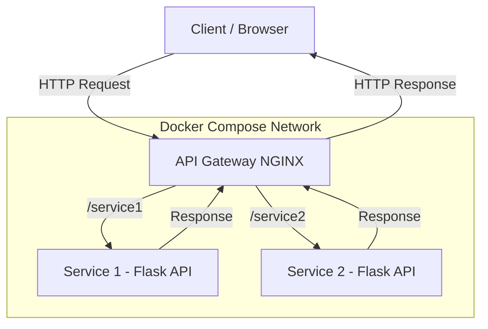
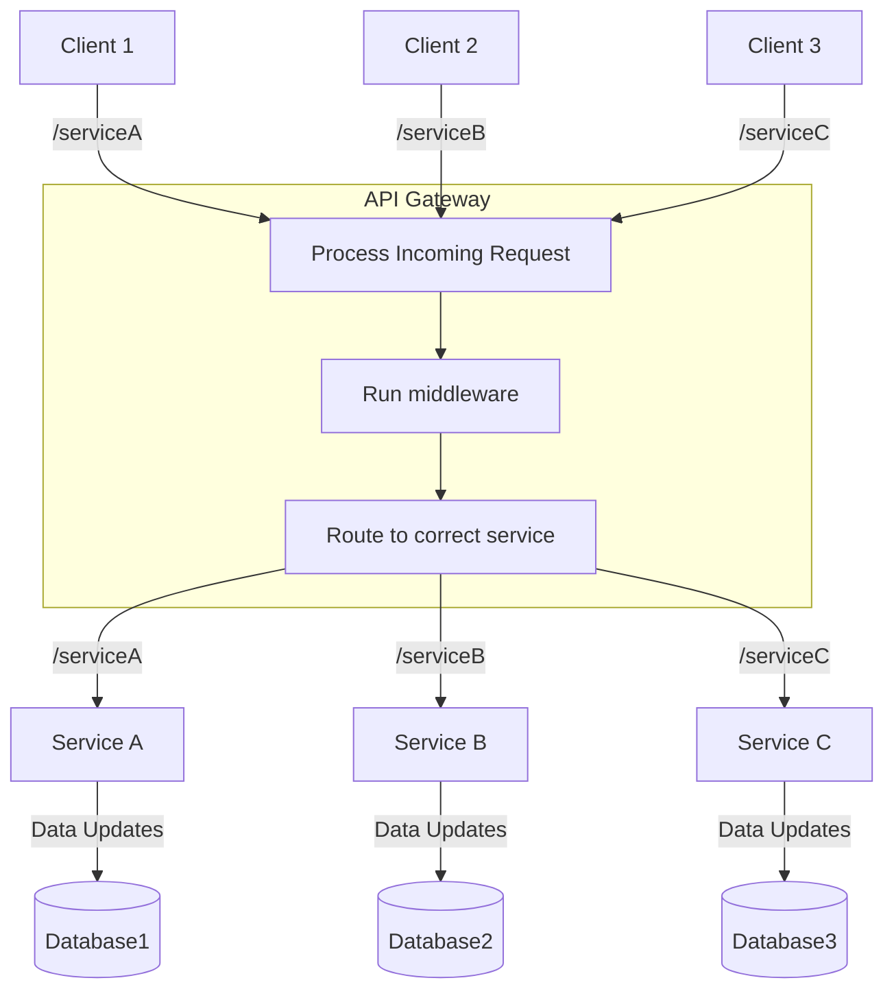
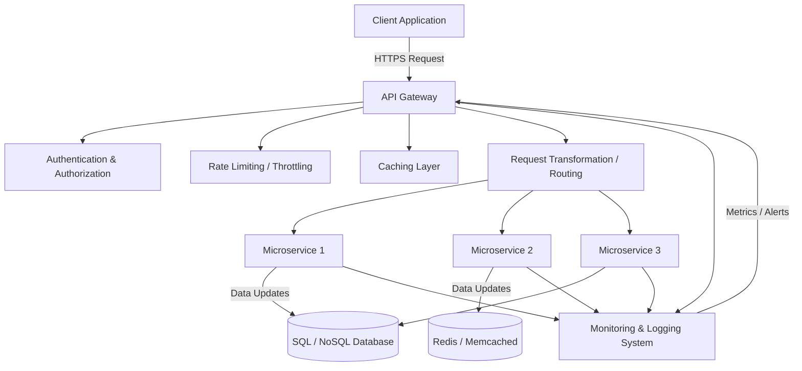

Various types of API gateways that comes up during interviews

Draw a simple API Gateway

Show the flow of services and the logic inside the API gateway

Draw an API gateway with some of the different kinds of middle layer you might utilise

