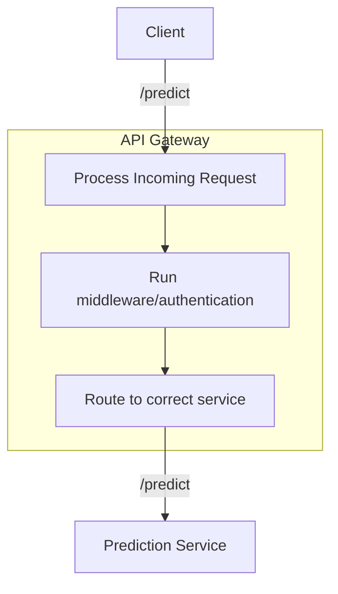

# Objective
Design an API gateway, for a prediction service, requiring authentication

Implement it

# API Architecture



The simple API architecture that will process the incoming request, check for the authentication (JWT header), and route to the correct prediction service

For implementation, we will utilize Kong as the API gateway

A sample application inside the folder app will run as a mock prediction service

Create a .env.kong file in the current folder, and make sure you have the following environmental variables declared

```bash
JWT_CONSUMER=xxx
JWT_KEY=xxx
JWT_SECRET=xxx
JWT_ALGORITHM=xxx
```

You can use the following default values

```
JWT_CONSUMER=jwt_consumer
JWT_KEY=YJdmaDvVTJxtcWRCvkMikc8oELgAVNcz
JWT_SECRET=C50k0bcahDhLNhLKSUBSR1OMiFGzNZ7X
JWT_ALGORITHM=HS256
```

Run the following to build the docker image

```bash
./build.sh
```

Once the image is built, you can simply run the docker compose command to run

```bash
docker compose up -d
```

Once it is up, you can run either test.sh

```bash
./test.sh
```

Or run the python application

```bash
python async_client.py
```

