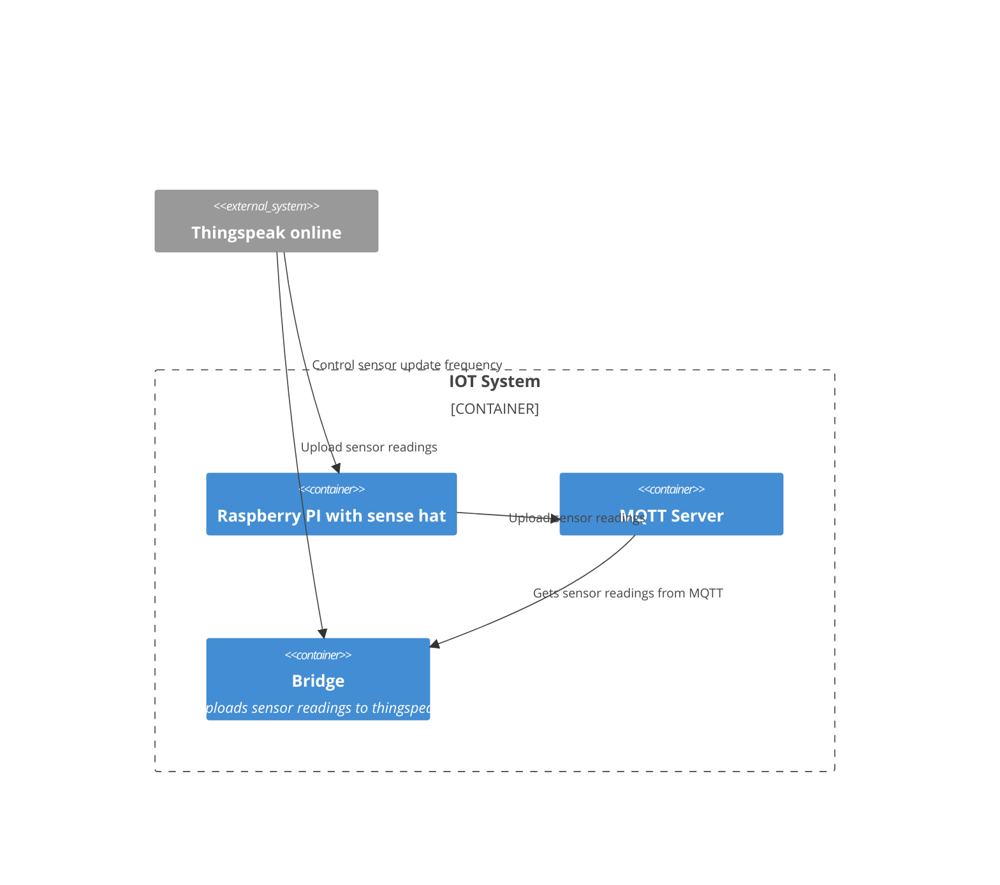
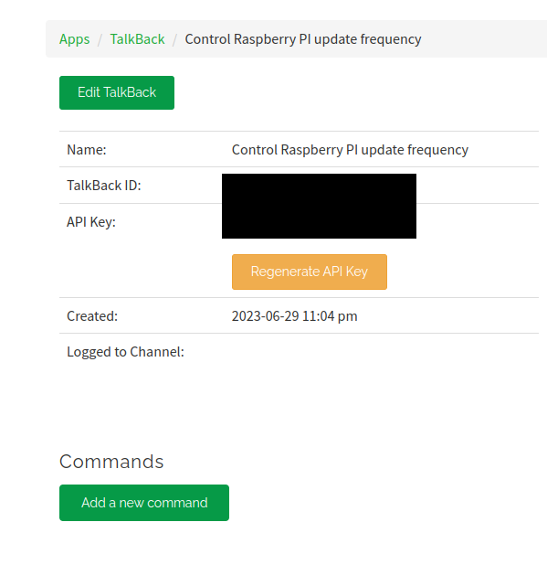
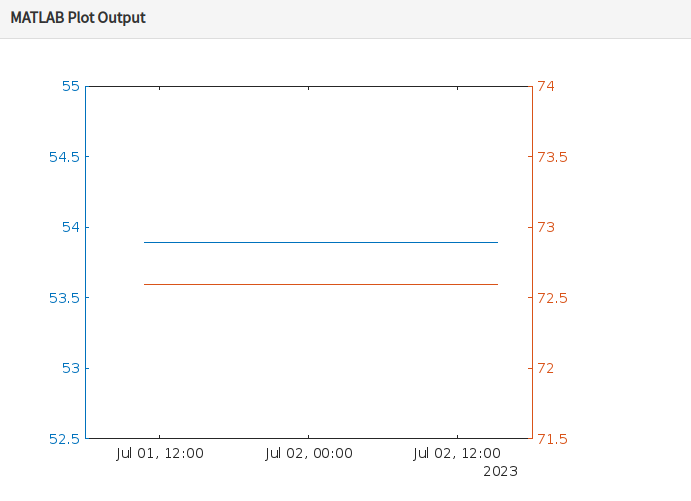

# Introduction
This is a concept design for an IOT application that is based on using the raspberry pi (with sensehat) as an IOT device, sending the data to a MQTT server (Mosquitto), and using the thingspeak to 
1. Control the sensor frequency update
2. Perform simple data analysis and weather prediction
3. Display custom visualization output with 48hr data trends

# Architecture




# Raspberry PI and Sensehat
Connect the sensehat to the raspberrypi and install the client application that pulls the readings (temperature, humidity, pressure) from the sensehat (found in client/mqtt_sensor.py). Configure the MQTT server address and port in the client application via environment variables or a .env file.

In this application, it will also poll the talkback api from thingspeak to get the sensor update frequency. The sensor update frequency is set by the user via the thingspeak dashboard. The client application will then update the sensor readings to the MQTT server based on the frequency.

Usage example, if you want the update frequency to be 20 seconds, you can add via the dashboard and send the command update_frequency:20, or use
curl -X POST https://api.thingspeak.com/talkbacks/{TALKBACK_ID}/commands.json?api_key={TALKBACK_API_KEY} -d "command_string=update_frequency:20"

# Middleware Mosquitto
The MQTT server is run as a docker instance. You can create the middleware by running docker compose up -d under the middleware folder (docker-compose.yml)

You can create the bridge to upload to thingspeak via the docker-compose file as well by running
docker compose build
This application will upload the sensor readings to thingspeak by listening to the MQTT server.

This will build a docker image that will run the bridge application (found in middleware/bridge.py) that will subscribe to the MQTT server and upload the data to thingspeak.

# Thingspeak
## Control the sensor frequency update

You can create a talkback app in thingspeak, and place the talkback api key and talkback id into the .env file in the raspberry pi client application. This will allow the client application to poll the talkback api to get the sensor update frequency. See the code in client/mqtt_sensor.py for more details.



## Perform simple data analysis and weather prediction

A sample matlab code to perform simple data analysis (mean of humidity) is as follows

```matlab
readChannelID = ''; # Enter the channel ID to read data from
humidityFieldID = 1; # Enter the Field ID to read data from
readAPIKey = ''; # Enter the API key if your channel is private
humidity = thingSpeakRead(readChannelID,'Fields',humidityFieldID,'NumMinutes',30,'ReadKey',readAPIKey);  
avgHumidity = mean(humidity); 
display(avgHumidity,'Average Humidity')
```
Example output


A sample for custom visualization is as follows

```matlab
readChannelID = []; # Enter the channel ID to read data from
fieldID1 = [1]; # Enter the Field ID to read data from
fieldID2 = [2]; # Enter the Field ID to read data from

% Channel Read API Key 
% If your channel is private, then enter the read API
% Key between the '' below: 
readAPIKey =  '' 

%% Read Data %%

% Read first data variable
[data1, time1] = thingSpeakRead(readChannelID, 'Field', fieldID1, 'NumPoints', 30, 'ReadKey', readAPIKey);

% Read second data variable
[data2, time2] = thingSpeakRead(readChannelID, 'Field', fieldID2, 'NumPoints', 30, 'ReadKey', readAPIKey);

%% Visualize Data %%

yyaxis left;
plot(time1, data1)

yyaxis right;
plot(time2, data2);
```
Example plot

