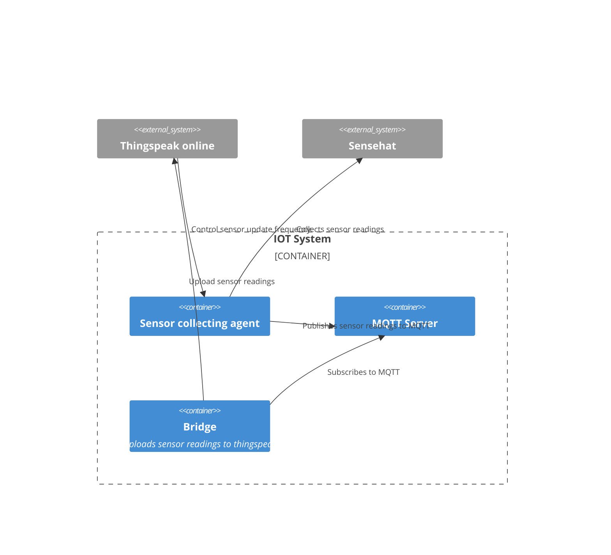
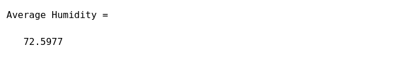

# Problem
You are given the following requirements
1. The IOT device is a raspberrypi with sensehat
2. A middleware MQTT server (Mosquitto)
3. A cloud service (Thingspeak) that will
    1. Control the sensor frequency update
    2. Perform simple data analysis and weather prediction
    3. Display custom visualization output with 48hr data trends

Design a solution that will meet the requirements. Show necessary diagrams and code snippets.

# Solution

We will use the IOT device (raspberrypi with sensehat), and since this particular device is actually a computer, we can create and run scripts on it to collect the sensor readings and publish it to the MQTT server.

While it is possible for the IOT device to send the data out directly to the cloud service (Thinkspeak), it will probably perform much better if we use a middleware to handle the data collection first (closer to the IOT device), and then send the data to the cloud service.

This design also means you can actually have multiple IOT devices sending data to the middleware, and the middleware will handle the data collection for all closeby IOT devices.

A bridging application or service can then be used to pull the data from the middleware and send it to the cloud service.

## Architecture




## Raspberry PI and Sensehat
Connect the sensehat to the raspberrypi and install the client application that pulls the readings (temperature, humidity, pressure) from the sensehat (found in client/mqtt_sensor.py). Configure the MQTT server address and port in the client application via environment variables or a .env file.

In this application, it will also poll the talkback api from thingspeak to get the sensor update frequency. The sensor update frequency is set by the user via the thingspeak dashboard. The client application will then update the sensor readings to the MQTT server based on the frequency.

Usage example, if you want the update frequency to be 20 seconds, you can add via the dashboard and send the command update_frequency:20, or use
curl -X POST https://api.thingspeak.com/talkbacks/{TALKBACK_ID}/commands.json?api_key={TALKBACK_API_KEY} -d "command_string=update_frequency:20"

If you don't possess a sensehat (but you do possess a raspberrypi), you can use the sense hat simulator, and simply change the client code from importing sense_hat to importing sense_emu

## Middleware Mosquitto
The MQTT server is run as a docker instance. You can create the middleware by running docker compose up -d under the middleware folder (docker-compose.yml)

You can create the bridge to upload to thingspeak via the docker-compose file as well by running
docker compose build
This application will upload the sensor readings to thingspeak by listening to the MQTT server.

This will build a docker image that will run the bridge application (found in middleware/bridge.py) that will subscribe to the MQTT server and upload the data to thingspeak.

## Thingspeak
### Control the sensor frequency update

You can create a talkback app in thingspeak, and place the talkback api key and talkback id into the .env file in the raspberry pi client application. This will allow the client application to poll the talkback api to get the sensor update frequency. See the code in client/mqtt_sensor.py for more details.

The command should be update_frequency:xxx


### Perform simple data analysis and weather prediction

A sample matlab code to perform simple data analysis (mean of humidity) is as follows

```matlab
readChannelID = ''; # Enter the channel ID to read data from
humidityFieldID = 1; # Enter the Field ID to read data from
readAPIKey = ''; # Enter the API key if your channel is private
humidity = thingSpeakRead(readChannelID,'Fields',humidityFieldID,'NumMinutes',30,'ReadKey',readAPIKey);  
avgHumidity = mean(humidity); 
display(avgHumidity,'Average Humidity')
```
Example output



### Custom visualization

A sample matlab code to visualize the data is as follows

```matlab
readChannelID = []; # Enter the channel ID to read data from
fieldID1 = [1]; # Enter the Field ID to read data from
fieldID2 = [2]; # Enter the Field ID to read data from

% Channel Read API Key 
% If your channel is private, then enter the read API
% Key between the '' below: 
readAPIKey =  '' 

%% Read Data %%

% Read first data variable
[data1, time1] = thingSpeakRead(readChannelID, 'Field', fieldID1, 'NumPoints', 30, 'ReadKey', readAPIKey);

% Read second data variable
[data2, time2] = thingSpeakRead(readChannelID, 'Field', fieldID2, 'NumPoints', 30, 'ReadKey', readAPIKey);

%% Visualize Data %%

yyaxis left;
plot(time1, data1)

yyaxis right;
plot(time2, data2);
```
Example plot

