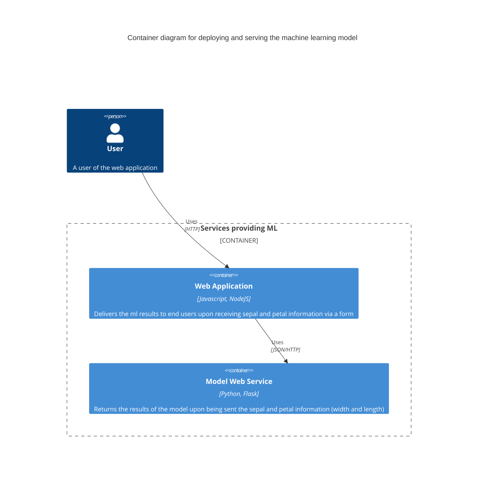

Scenario

You were just given the jupyter notebook of one of your data scientist, who has created a model based on his analysis. Using this notebook as a start, create a pipeline that deploys the model, and have a web application call this deployed model for predictions. You are given this notebook, iris.ipynb

Solution

Created a bash script (build.sh) that will build all the relevant components, namely
1. Using convert.py, that will convert the ipynb to a python file, suppressing the plots created by commenting them out in the final python file
2. Add lines to the end of the converted python file (output_model.py) that will export the model to a pickle file format
3. Create a flask container application (app.py) that will load this model file via docker build
4. Create the web application container that will use the flask container via docker build
5. Compose both containers via docker compose

The user interacts with the containers in the following manner
1. User will input the relevant sepal/petal length/width via the web app
2. The web app will invoke the ml app at the backend via REST
3. The ml app expects a json object to be posted to its url (/prediction)
4. Upon being called with the relevant sepal_width, sepal_length, petal_width, petal_length, it will return the predicted class, along with the probability, in a json format
6. The web application will display the result of the predicted cclass and probabilities to the end user