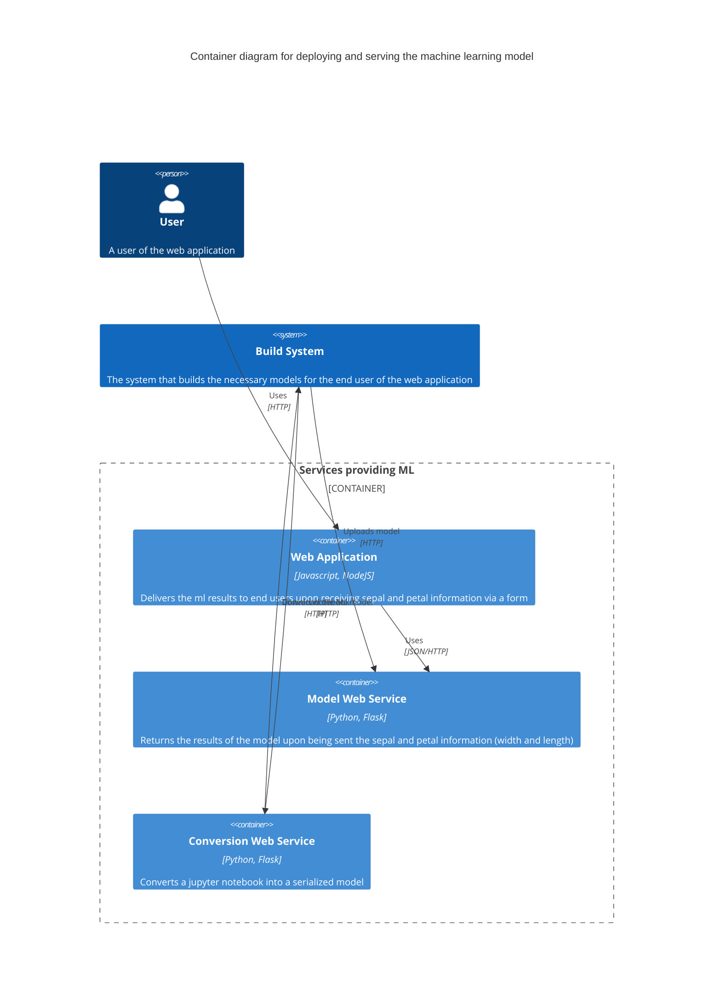

# Scenario

You were just given the jupyter notebook of one of your data scientist, who has created a model based on his analysis. Using this notebook as a start, create a pipeline that deploys the model, and have a web application call this deployed model for predictions. You are given this notebook, iris.ipynb

# Solution

This is a standalone solution if services are to be consumed internally. Created a bash script (run.sh) that will perform the creation and update of a usable machine learning model, namely
1. Takes the jupyter notebook, and uploads it to the conversion web service that converts it to python code, and utilizing this python code to generate a portable ML model
2. Download this ML model from the conversion web service
3. Upload this model to a running machine learning web service will update its currently serving model

The user interacts with the containers in the following manner
1. User will input the relevant sepal/petal length/width via the web app
2. The web app will invoke the ml app at the backend via REST
3. The ml app expects a json object to be posted to its url (/prediction)
4. Upon being called with the relevant sepal_width, sepal_length, petal_width, petal_length, it will return the predicted class, along with the probability, in a json format
6. The web application will display the result of the predicted cclass and probabilities to the end user

# Instructions for Linux
In order to recreate this solution, ensure you are running in a linux console, and have installed docker

1. Clone this repository
2. To build the relevant web services, run docker compose build
3. Use run.sh to simulate the conversion and upload process (upload iris.ipynb, download the model, update the ml web service), call the web app backend with curl
4. Browse to the web application (localhost:[port]) to test it further with other values

# Instructions for Windows
In order to recreate this solution, ensure you are running in a powershell console, and have already installed docker desktop. Make sure you enable WSL

1. Clone this repository
2. Build the relevant web services by running docker compose build
3. Use run.ps1 in the powershell console to create and upload the model, and calling the webapp backend via Web-Request
4. Browse to the web application (localhost:[port]) to test it further with other values